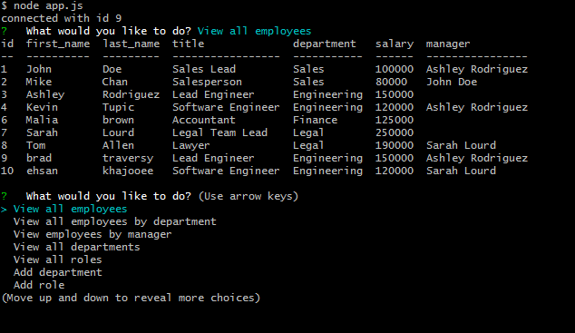

# Employee Tracker App

In this project I built a **C**ontent **M**anagment
**S**ystem for managing a company's employees using node, inquirer, and MySQL. I used the inquirer npm package which is a CLI interface for nodejs and the MySQL npm package which is a MySQL driver to connect to the MySQL database. The MySQL database consists of department, role and employee tables. A command-line interface was built to view, add, and update employees, roles and their departments. Also the app includes features like filtering the view of employees by department and manager. The Employee Tracker methods are all promised based. Lastly, this app demonstrates SQL JOIN commands used for viewing the data from all the linked tables (through foreign keys) together.

Below is a snapshot of the project.

## Instructions

Install the required dependencies by using the "npm install" command and run "node app.js".

## Usage
This app provides a CLI interface for the user to perform CRUD operations on the employees, their roles and deparments.

## Tests
This app was tested manually.

## Future
More CLI features such as updating employee managers and deleting departments, roles and employees will be added in the future.

  
  

